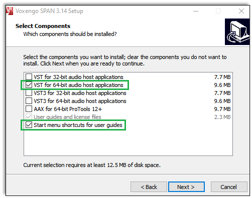

# testtask
Markdown and hosting on GitHub Pages

# Cabbage Plugin
### Compilation and Installation
This guide explains how to install, compile, and integrate audio software to visualize the generated sound effect in real time.
## Prerequisites
Download the following software from the official websites to your default directory:
- **Cabbage** [https://cabbageaudio.com](https://cabbageaudio.com)  
   > Free software for prototyping audio instruments with the Csound audio.  
- **REAPER**  [https://www.reaper.fm](https://www.reaper.fm)  
   > A digital audio production application.
- **SPAN VST** [https://www.voxengo.com/product/span/](https://www.voxengo.com/product/span/)  
   > A free real-time FFT audio spectrum analyzer.
   > 
For **SPAN VST** install only the selected components as shown below:  

## Plugin Compilation in Cabbage  
1. Launch _Cabbage_ from the Windows Start Menu. 
2. Open a pre-created `spectra.сds` file: **File** > **Open Csound file**. 
3. Click **File** > **Export plugin** > **Export as VST Plugin Effect**.   
- In **Save file as** dialog:      
   1. Create a **VST** folder.  
   2. Name the file, for example, `spectra.dll` and save it to the **VST** folder.
4. Close _Cabbage_.
5. Make sure the **VST** folder contains the two files:  
   - [x] `.csd project file`  
   - [x] `.dll library file`
## Plugin Integration into REAPER
1. Open _REAPER_ on your desktop.
2. To use the application with the free Evaluation license, do the following in **About REAPER** window:
   - Notice that the **Buy Me** button displays countdown. 
   - Wait for the button text to change to **Still Evaluating**.
   - Click **Still Evaluating**.  
   
3. Specify audio device settings: click **Options** tab > **Preferences**.  
   1. Click **REAPER Preferences** > **Device**:
     - **Audio system**: _ASIO_
     - **ASIO Driver**: _Roland Rubix_ 
   2. In the **REAPER Preferences** list scroll down and select **VST**.
   3. In **VST plug-ins settings** section:
   * Click **Edit path list** button > **Add path** > navigate to add `Cabbage\VST directory`.
   * Click **Edit path list** button > **Add path** > navigate to add path to SPAN. **_NOTE:_** by default it is installed to `C:\Program Files\Common Files\VST2\Voxengo`. 
   * Click **Re-scan** button > select **Re-scan VST paths for new/modified plug-ins**.
   4. After scanning click **OK** to close the **REAPER Preferences** dialog.
4. Click **File** > **Open project** > `spectra` (REAPER project file).
5. The program displays three windows:  
    - REAPER project
    - VST SPAN spectrum analyzer
    - Cabbage plugin
 ### Cabbage Plugin Window
In Cabbage plugin window update `VST:spectra` as the previous settings may be irrelevant/outdated:
1. Select`VST:spectra...` item.
2. Click **Remove** button.
3. Click **Add** button.
- In **Add** dialog select **New** > `VST:spectra (Cabbage Audio)`, and click **Add**.
4. Back in the Cabbage plugin window, drag `VST:spectra` up to make it the first item in the list:

   
   
  
#### Plugin Controls  
**Noise Type** knob:
> type 0 – white noise  
> type 1 – pink noise  
> type 2 – brown noise    

**Noise Level** knob   
> tunes the generated noise level in response to the vacuum cleaner output.

**MIX** knob   
> controls the level of effect.

<mark>Sorry, I need to stop here due to NDA restrictions</mark>
